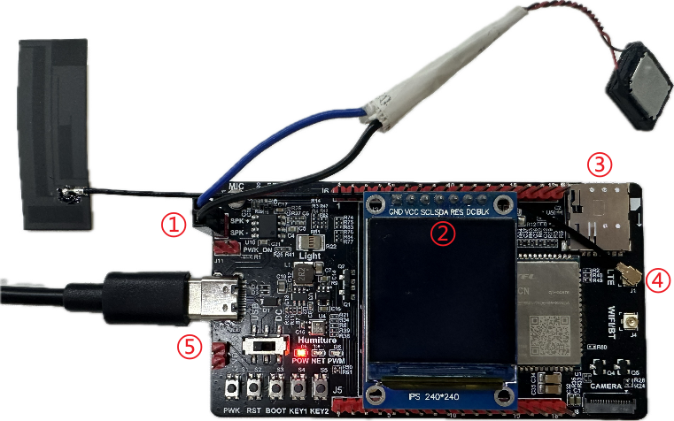

# QuecPython POC Solution

[中文](README.zh.md) | English

Welcome to the QuecPython POC Solution repository! This repository provides a comprehensive solution for developing POC device applications using QuecPython.

## Table of Contents

- [Introduction](#introduction)
- [Features](#features)
- [Getting Started](#getting-started)
  - [Prerequisites](#prerequisites)
  - [Installation](#installation)
  - [Running the Application](#running-the-application)
- [Directory Structure](#directory-structure)
- [Contributing](#contributing)
- [License](#license)
- [Support](#support)

## Introduction

QuecPython has launched a POC intercom solution, which is based on the BND PoC library and can only use firmware that supports PoC functionality.

The module models that support PoC functionality are as follows:

| Series | Module                                                       |
| :----- | :----------------------------------------------------------- |
| EC600M | EC600MCN_LA、EC600MCN_LE、EC600MCN_LF、EC600MEU_LA、EC600MLA_LA |
| EC800M | EC800MCN_LA、EC800MCN_LE                                     |
| EC600U | EC600UEU_AB                                                  |
| EC800G | EC800GCN_LD                                                  |

## Features

- Provide half duplex high-definition and secure voice intercom function.
- Support connecting commonly used intercom platforms: ZZD, SL, BND and XIN platforms.
- Ultra long standby: Supports ultra-low power consumption mode.
- Using Python language for easy secondary development.

## Getting Started

### Prerequisites

Before you begin, ensure you have the following prerequisites:

- **Hardware**:
  - Two sets of EC600MCNTE QuecPython standard development boards, each including antenna, Type-C data cable, etc
    > Click for POC EVB's [schematic](https://python.quectel.com/en/wp-content/uploads/sites/2/2024/12/EC600X_Series_EVB_SCH.pdf) and [silk screen](https://python.quectel.com/en/wp-content/uploads/sites/2/2024/12/EC600X_Series_EVB_SilkScreen.pdf) documents.
  - PC (Windows 7, Windows 10, or Windows 11)
  - LCD display screen
    - Module: ST7789
    - Resolution: 240×240
  - Horn
    - Any 2-5W power horn is sufficient

- **Software**:
  - USB driver for the QuecPython module: [QuecPython_USB_Driver_Win10_ASR](https://images.quectel.com/python/2023/04/Quectel_Windows_USB_DriverA_Customer_V1.1.13.zip)
  - debugging tool: [QPYcom](https://python.quectel.com/en/wp-content/uploads/sites/2/2024/11/QPYcom_V3.6.0.zip)
  - QuecPython firmware and related software resources.
  - Python text editor (e.g., [VSCode](https://code.visualstudio.com/), [Pycharm](https://www.jetbrains.com/pycharm/download/)).

### Installation

1. **Clone the Repository**:
   ```bash
   git clone https://github.com/QuecPython/solution-POC.git
   cd solution-POC
   ```

2. **Flash the Firmware**:
   Follow the [instructions](https://python.quectel.com/doc/Application_guide/en/dev-tools/QPYcom/qpycom-dw.html#Download-Firmware) to flash the firmware to the development board.

### Running the Application

1. **Connect the Hardware**:
   Connect the hardware according to the following diagram:
    
   1. Connect the horn to the pins labeled `SPK+` and `SPK-` in the diagram.
   2. Connect the LCD screen to the pin bank labeled with the word `LCD`.
   3. Insert an available Nano SIM card at the indicated position.
   4. Connect the antenna to the antenna connector marked with the word `LTE`.
   5. Connect the development board and computer using a Type-C data cable.

2. **Download Code to the Device**:
   - Launch the QPYcom debugging tool.
   - Connect the data cable to the computer.
   - Press the **PWRKEY** button on the development board to start the device.
   - Follow the [instructions](https://python.quectel.com/doc/Application_guide/en/dev-tools/QPYcom/qpycom-dw.html#Download-Script) to import all files within the `code` folder into the module's file system, preserving the directory structure.

3. **Run the Application**:
   - Select the `File` tab.
   - Select the `poc_main.py` script.
   - Right-click and select `Run` or use the run shortcut button to execute the script.

## Directory Structure

```plaintext
solution-POC/
├── code/
│   ├── dev/
│   │   ├── key.py
│   │   └── lcd.py
│   ├── img/
│   │   ├── battery_1.png
│   │   ├── battery_2.png
│   │   └── ...
│   ├── ui/
│   │   ├── styles.py
│   │   └── ui.py
│   ├── common.py
│   ├── services.py
│   └── poc_main.py
├── docs/
│   ├── en/
│   │   └── media/
│   └── zh/
│       └── media/
├── EC600MCNLER06A01M08_POC_XBND_OCPU_QPY_BETA0117.zip
├── LICENSE
├── readme.md
└── readme_zh.md
```

## Contributing

We welcome contributions to improve this project! Please follow these steps to contribute:

1. Fork the repository.
2. Create a new branch (`git checkout -b feature/your-feature`).
3. Commit your changes (`git commit -m 'Add your feature'`).
4. Push to the branch (`git push origin feature/your-feature`).
5. Open a Pull Request.

## License

This project is licensed under the Apache License. See the [LICENSE](LICENSE) file for details.

## Support

If you have any questions or need support, please refer to the [QuecPython documentation](https://python.quectel.com/doc/en) or open an issue in this repository.
