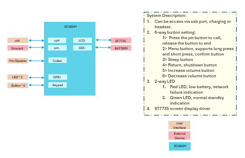
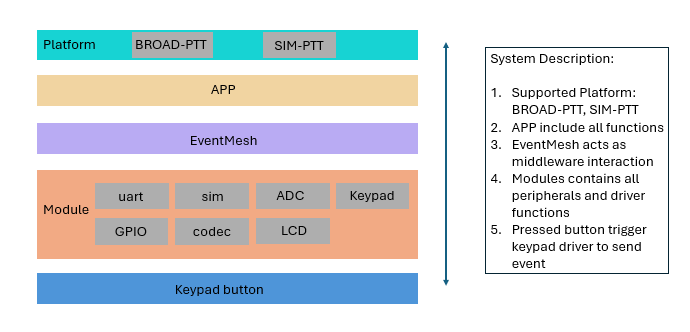
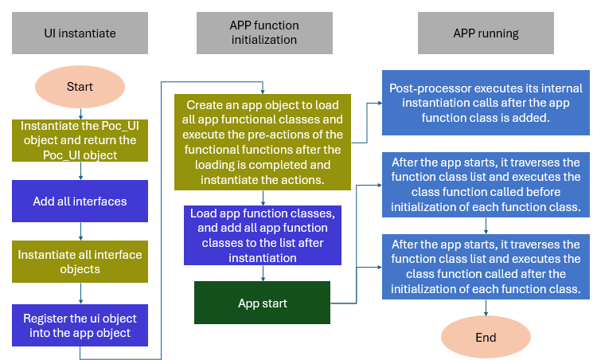

# POC Solution for QuecPython 

[中文](readme_zh.md) | English

## Introduction to POC
### Overview
- Push-To-Talk over Cellular radio and solution
- Provide real-time voice communication and reduce information transmission delay
- Supports connection to various intercom platforms: CORGET, SHANLI, BROAD-PTT and XIN-PTT
- Ultra-long standby: supports ultra-low power consumption mode

### Functions
- Real-time intercom: group chat, individual call, multi-person temporary group
- Multiple positioning: GNSS, base station positioning
- Weather forecast: identify weather patterns, temperature display

### Applications
- Security monitoring
- Building Construction
- Transportation and Logistics
- Medical emergency
- Large events: real-time coordination

 ### Hardware system framework
 - The module side supports SIM, UART, codec, keypad, LCD, ACD, LED and other functions
 - The module triggers event notifications through keypad and UART



 ### Software system framework
- The APP layer implements processing of POC core services and parses uplink and downlink data.
- EventMesh acts as an event processor that completes function flow by supporting event subscription and publishing mechanisms.



### POC system initialization flow chart



## Getting Started
### Prerequisites
Before you begin, ensure you have the following prerequisites:
- **Hardware：**
  - QuecPython development kit or POC device
  - USB Data Cable （USB-A to USB-C）
  - PC （Windows 7，Windows 10 或 Windows 11）
- **Software**
  - USB driver for QuecPython module (click [here](https://python.quectel.com/en/download) to search and download)
  - QPYcom debugging tool (click [here](https://images.quectel.com/python/2022/12/QPYcom_V3.5.zip) to download for window, [here](https://images.quectel.com/python/2023/06/QPYcom_V3.0.2_linux.tar_.gz) for linux)
  - QuecPython firmware and related software resources (click [here](https://python.quectel.com/en/download) to search and download)
  - Python text editor （e.g., [VSCode](https://code.visualstudio.com/), [Pycharm](https://www.jetbrains.com/pycharm/download/)）


### Installation
1. **Clone the Repository：**
   ```bash
   git clone https://github.com/QuecPython/solution-POC.git
   cd solution-POC
   ```
3. **Flash the Firmware:** Follow the [instructions](https://python.quectel.com/doc/Application_guide/en/dev-tools/QPYcom/qpycom-dw.html) to flash the firmware to the development board.

 
 ### Running the Application
  1. **Connect the Hardware：**
      - Use a USB cable to connect the development board to the computer's USB port.
  2. **Download code to the device：**
      - Lauch the QPYcom debugging tool.
      - Connect the data cable to the computer.
      - Press the **PWRKEY** button on the development board to turn on the devive.
      - Follow the [instructions](https://python.quectel.com/doc/Application_guide/en/dev-tools/QPYcom/qpycom-dw.html) to import all files within the `code` folder into the module's file system, preserving the directory structure.
  3. **Run the Application：**
      - Select the `File` tab.
      - Select the `main.py` script.
      - Right click and select `Run` or use the shortcut button to execute the script.

## Directory Structure
```plaintext
solution-POC/
├── code/
│   ├── main.py
|   ├── mgr.py
|   ├── ui.py
|   ├── common.py
|   ├── EventMesh.py
|   └── btn_device_600m.py
├── docs/
|   ├── en/
|   |   └── media/  
|   └── zh/
|       └── media/
├── static_file/static/
├── readme.md
└── readme_zh.md
```
  
