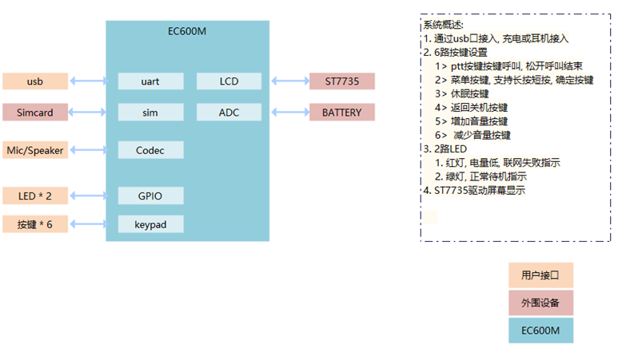
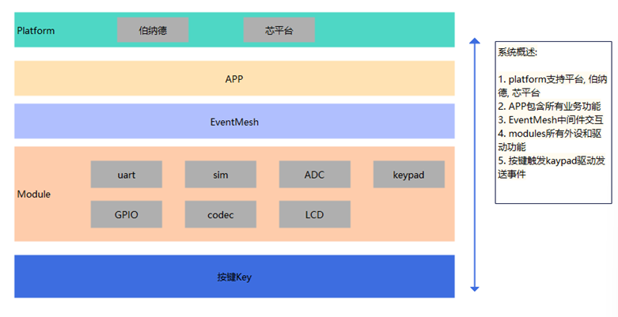
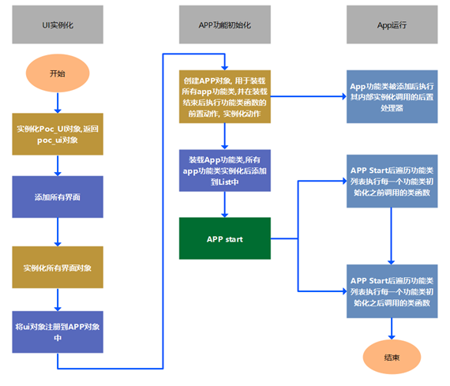

# QuecPython 公网对讲机解决方案

中文 | [English](readme.md)

## POC 介绍

### 产品概述
- POC公网对讲机
- 提供实时的语音通信，减少信息传递的延迟
- 支持连接各种对讲平台：卓智达、善理、伯纳德、 芯平台
- 超长待机: 支持超低功耗模式

### 产品功能
- 实时对讲: 群聊、单呼、多人临时群组
- 多重定位: GNSS、基站定位
- 天气预报：识别天气模式，温度显示

### 应用行业
- 安保监控
- 建筑施工
- 交通物流
- 医疗急救
- 大型活动：实时协调

 ### 硬件系统框架
 - module侧支持 SIM, UART, codec, keypad, LCD, ACD, LED等功能
 - module通过keypad和UART来触发事件通知



 ### 软件系统框架
- APP层实现处理POC核心业务，解析上下行数据
- EventMesh为事件处理器，通过支持事件订阅发布的机制来完成功能流转



### POC系统初始化流程表



## 快速开始
### 先决条件
在开始之前，请确保你具备以下先决条件：
- **硬件：**
  - QuecPython 开发板套件或 POC 设备
  - USB数据线 （USB-A转USB-C）
  - 电脑 （Windows 7，Windows 10 或 Windows 11）
- **软件**
  - QuecPython 模块的 USB 驱动 (点击[这里](https://python.quectel.com/download)搜寻并下载)
  - QPYcom 调试工具 (点击[这里](https://images.quectel.com/python/2022/12/QPYcom_V3.5.zip)下载for window, [这里](https://images.quectel.com/python/2023/06/QPYcom_V3.0.2_linux.tar_.gz)for linux)
  - QuecPython 固件及相关软件资源 (点击[这里](https://python.quectel.com/download)搜寻并下载)
  - Python 文本编辑器 （例如, [VSCode](https://code.visualstudio.com/), [Pycharm](https://www.jetbrains.com/pycharm/download/)）


### 安装
1. **克隆仓库：**
   ```bash
   git clone https://github.com/QuecPython/solution-POC.git
   cd solution-POC
   ```
3. **烧录固件:** 按照[说明](https://python.quectel.com/doc/Application_guide/zh/dev-tools/QPYcom/qpycom-dw.html#Download-Script)将固件烧录到开发板上

 
 ### 运行应用程序
  1. **连接硬件：**
      - 使用 USB 数据线将开发板连接到计算机的 USB 端口
  2. **将代码下载到设备：**
      - 启动 QPYcom 调试工具
      - 将数据线连接到计算机
      - 按下开发板上的 **PWRKEY** 按钮启动设备
      - 按照[说明](https://python.quectel.com/doc/Application_guide/zh/dev-tools/QPYcom/qpycom-dw.html#Download-Script)将 `code` 文件夹中的所有文件导入到模块的文件系统中，保留目录结构
  3. **运行应用程序：**
      - 选择  `File` 选项卡
      - 选择 `main.py` 脚本
      - 右键单击并选择 `Run` 或使用 `运行` 快捷按钮执行脚本

## 目录结构
```plaintext
solution-POC/
├── code/
│   ├── main.py
|   ├── mgr.py
|   ├── ui.py
|   ├── common.py
|   ├── EventMesh.py
|   └── btn_device_600m.py
├── docs/
|   ├── en/
|   |   └── media/  
|   └── zh/
|       └── media/
├── static_file/static/
├── readme.md
└── readme_zh.md
```
  
